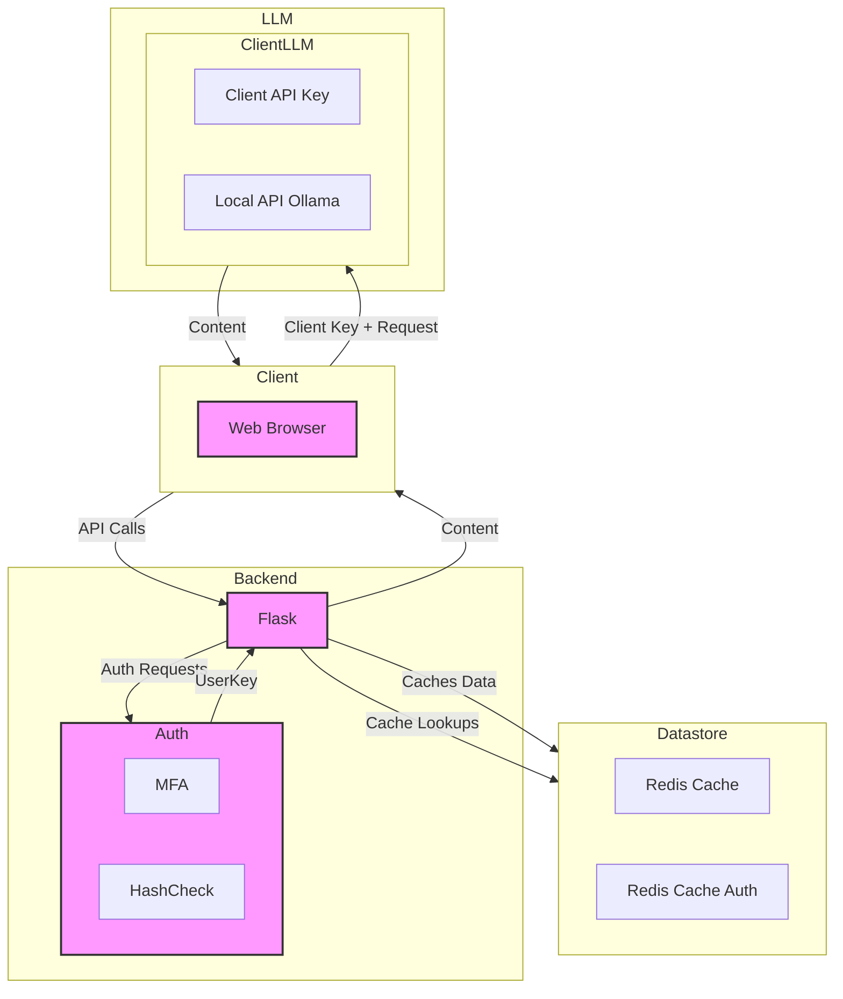

# Automatic Resume Builder

|||
|:---:|:---:|
| [Main Application](app.py) | [Application Config](lib/app_conf.py) |

---
## Data Architecture
    All data is persisted through REDIS. This includes user information, and any historic processed job postings.

### Session(s)
| Key | Usage|
|:---|:---|
| client_uuid | a handshake connection check between the site and server |
| csrf_token | a submission-specific connection check between the site and server |
| user_auth | a boolean representing user's account state |
| user_key | the authentication database's accessor key for user information |
| resume_sections | the processed user data from uploaded resume |
| resume_provided | a boolean representation of above existing in session |
| job_description | the processed job description from llm response |
| no_auth_email | a user's email (pre-authentication) from registration process |
| no_auth_pswd_hash | a user's password hash (pre-authentication) |
| auth_code | a system-generated value to be emailed to the user |
| auth_expiry | a calculated time at which to expire the auth_code |

#### TODO
- [ ] Triple check all data persistence and access
  - [ ] Ensure information is being properly moved through this application.
  - [ ] Create an Admin Page to allow for basic information mangement
  - [ ] Create reports for application traffic, availible to users
  - [ ] Allow users to update status of specific Resume's.
- [ ] Aggregate job description data
  - [ ] Collect and create reports, + API accessibility for premium
- [ ] Create Account Roles
  - [ ] Premium for purchase through Stripe
  - [ ] Admin/Tester Roles for Beta Launch

Sale of information: Currently, as of this time, there are no plans or contracts established for the sale of user-specific information. In the future, it is likely that de-identified data will be accessible to premium users.

---

## System Architecture
### Interlayer
    Where a typical site may use forms/models/database on the backend, the entirety of this site is purely API calls and Session-state management. It is important to understand the "handshake" behavior of this interaction, as well as the security practices implemented for client-server communications.

### Account-locked server processing
> Every action of this site is to be accessible to the client, in some limited capcity, through the utilization of their provided resources.

> As a PREMIUM member, the entire functionality of the site will be unlocked, and resources will be managed through the server itself.

#### This practice is including, but not limited to
- Rate Limits & Improved Rate Limits
- Resume Templates
- Model Selection
- Prompting Services
  - The exception of this category is Agents, which will be offered ONLY by the site
- API Accessibility for external applications

### LLM Integrations
It will be our intention to remain up-to-date with both the cost estimations, and newest model releases from the largest vendors. In any event that this information is not easily obtainable, There will be consideration to dropping support for the service.

---

## Marketing

### Mail services
As a basic form of marketing, mail templates & scheduled messages, should this service scale, will be implemented.

